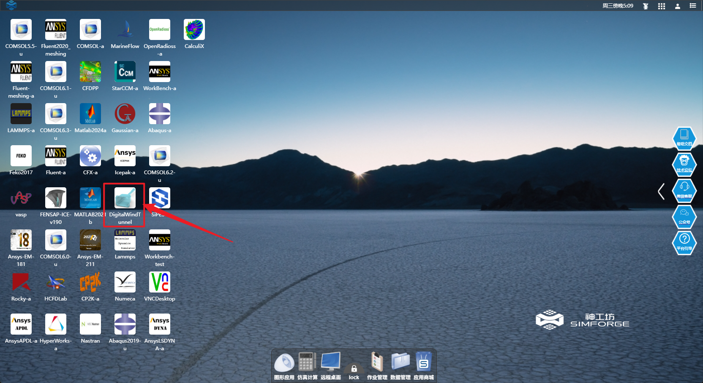
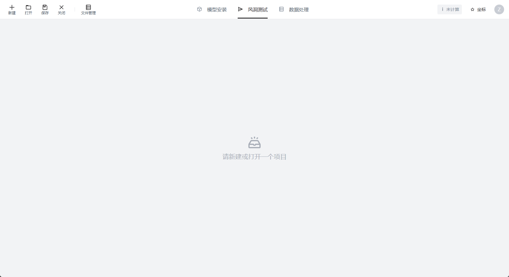

# 开始

欢迎使用「风神NF3」！ 

本手册旨在为「风神NF3」平台的使用用户提供详细的指导和说明。

## 登录神工坊平台

您可以单击该链接进入平台登录页面：[神工坊](https://studio.hpc.simforge.cn/)

可供登录测试的账号密码如下：
>组织编码：`digitalWindTunnel`

- 管理员账号
    - 账号：`dwt`
    - 密码：`dwt@123456`

- 子用户账号
    - 账号：`dwt1`
    - 密码：`dwt1@123456`

以上两个账号均可登录平台用于测试

## 打开「风神NF3」页面

双击 *DigitialWindTunnel* 图标可跳转到「风神NF3」页面

<figure markdown="span">
  { width="500" }
  <figcaption>双击 DigitialWindTunnel 图标</figcaption>
</figure>

<figure markdown="span">
  { width="500" }
  <figcaption>数字风洞默认页面</figcaption>
</figure>

