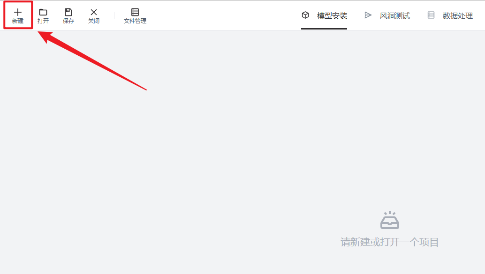
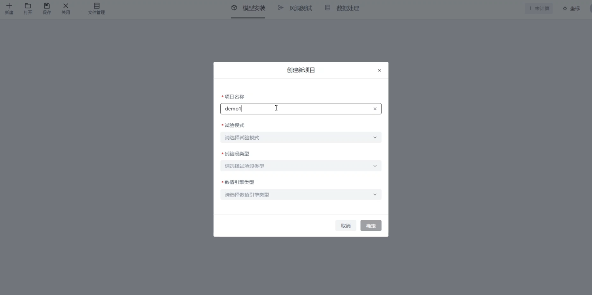
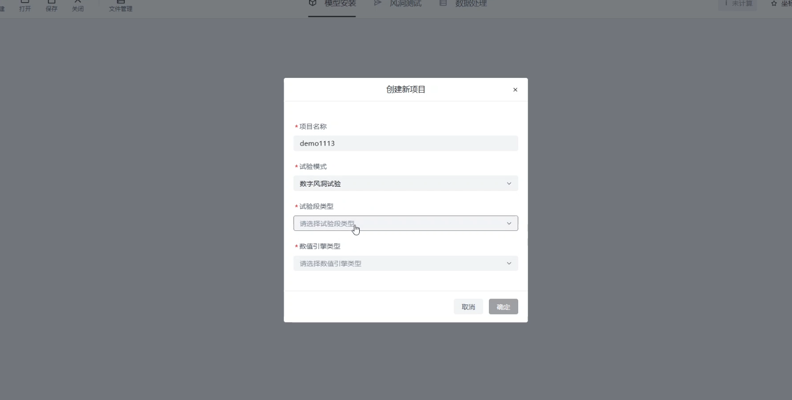
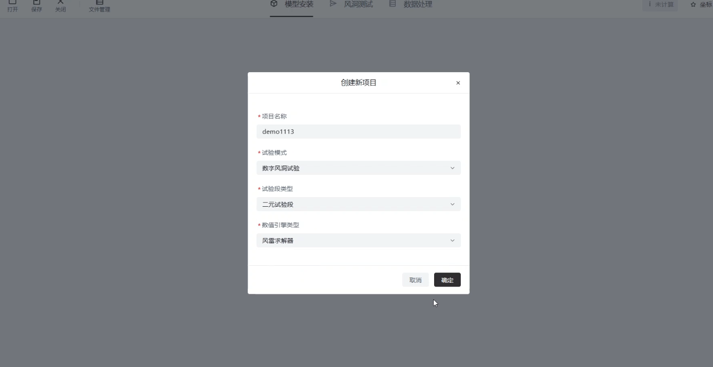
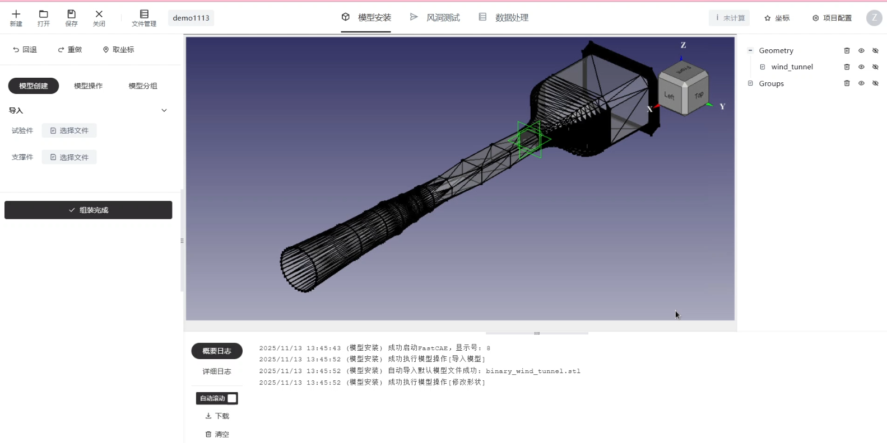

# 创建新项目

请按照如下步骤进行操作：

请单击新建按钮
<figure markdown="span">
  { width="500" }
  <figcaption>新建</figcaption>
</figure>

在此处输入项目名称
<figure markdown="span">
  { width="500" }
  <figcaption>项目名称</figcaption>
</figure>

选择数字风洞试验
<figure markdown="span">
  { width="500" }
  <figcaption>试验模式</figcaption>
</figure>

选择二元试验段、风雷求解器，单击确定
<figure markdown="span">
  { width="500" }
  <figcaption>试验段类型和数值引擎类型</figcaption> 
</figure>

此时进入一个新项目的初始化页面中，模型视窗中会自动加载二元风洞模型
<figure markdown="span">
  { width="500" }
  <figcaption>新项目默认页面</figcaption> 
</figure>

更多选项中的功能正在加紧开发中... ...
