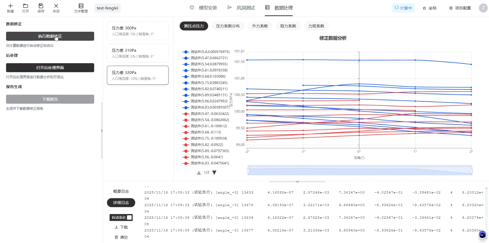
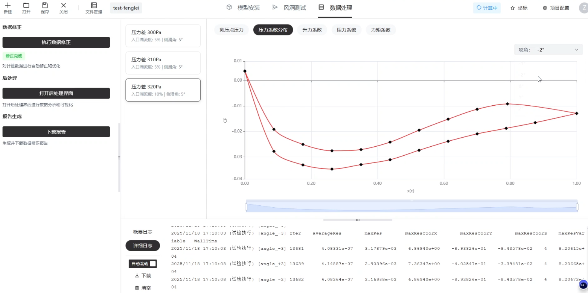

# 数据处理

切换到【数据处理】标签页

选择对应要处理的驱动条件后，单击【执行数据修正】，即可观察修正后的结果：测压点压力、压力系数分布、升力系数、阻力系数、力矩系数

<figure markdown="span">
  { width="500" }
  <figcaption>执行数据修正</figcaption> 
</figure>

<figure markdown="span">
  { width="500" }
  <figcaption>压力系数分布</figcaption> 
</figure>

可以通过最右侧的攻角下拉框切换不同攻角下的修正结果
