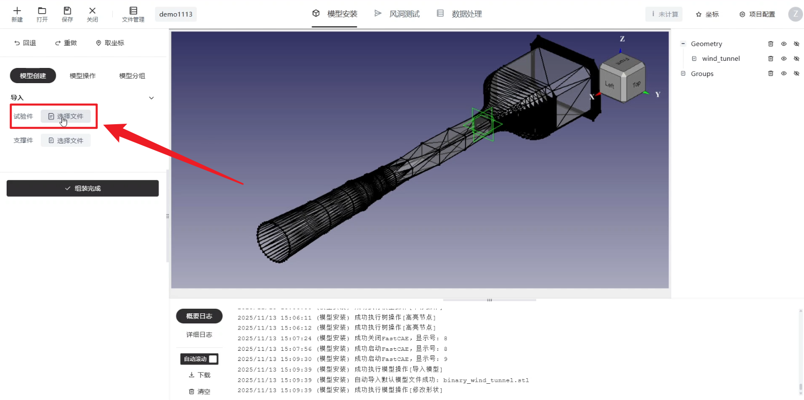
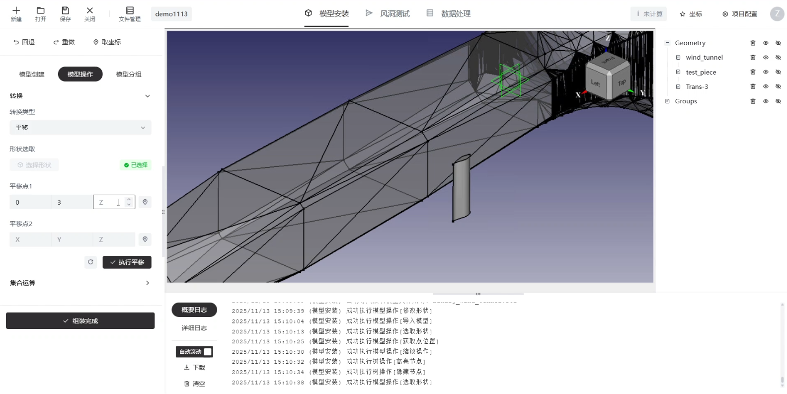
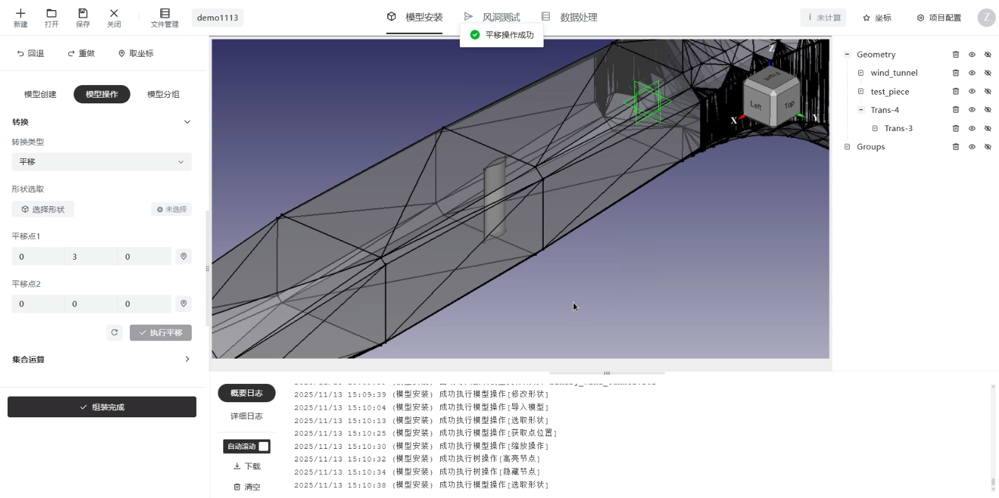
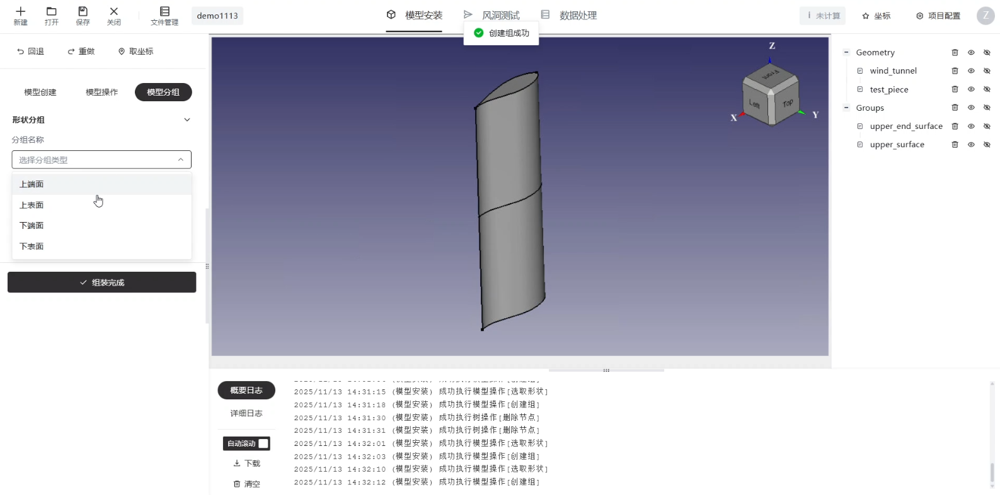

# 模型安装

## 模型创建

可以选择导入试验件，当前仅支持`.stp`格式的模型。在压缩包中已经包含了一个预设的二元翼型`.stp`模型，可以直接导入该模型，进行测试。或者如果自己手中有准备好的二元翼型stp模型，也可以选择导入。

<figure markdown="span">
  { width="500" }
  <figcaption>选择试验件</figcaption> 
</figure>

## 模型操作

可以进行平移等操作，将模型移动到合适的位置。

<figure markdown="span">
  { width="500" }
  <figcaption>平移前</figcaption> 
</figure>

<figure markdown="span">
  { width="500" }
  <figcaption>平移后</figcaption> 
</figure>

## 模型分组

可以进行模型分组操作，右侧模型树会出现对应的分组情况

操作完成后单击组装完成按钮

<figure markdown="span">
  { width="500" }
  <figcaption>模型分组</figcaption> 
</figure>

