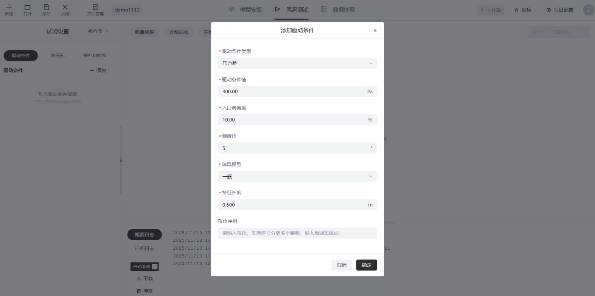
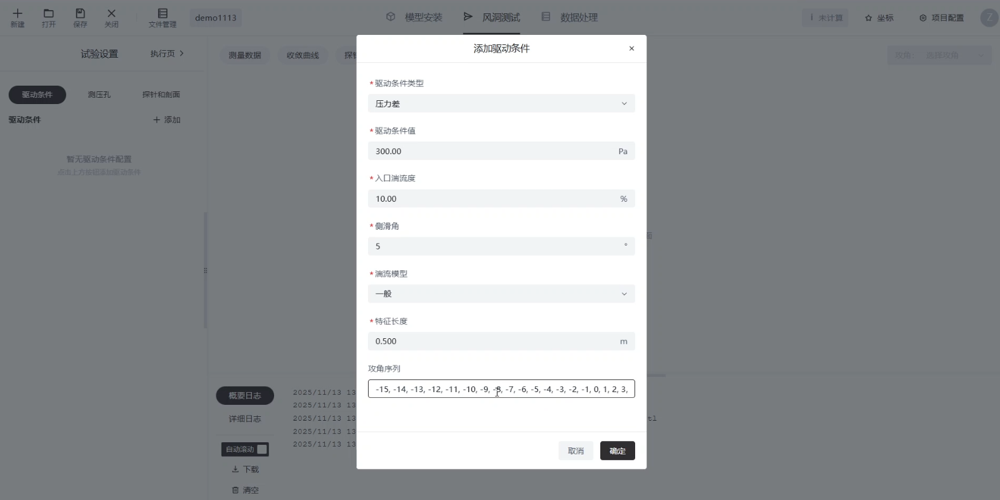
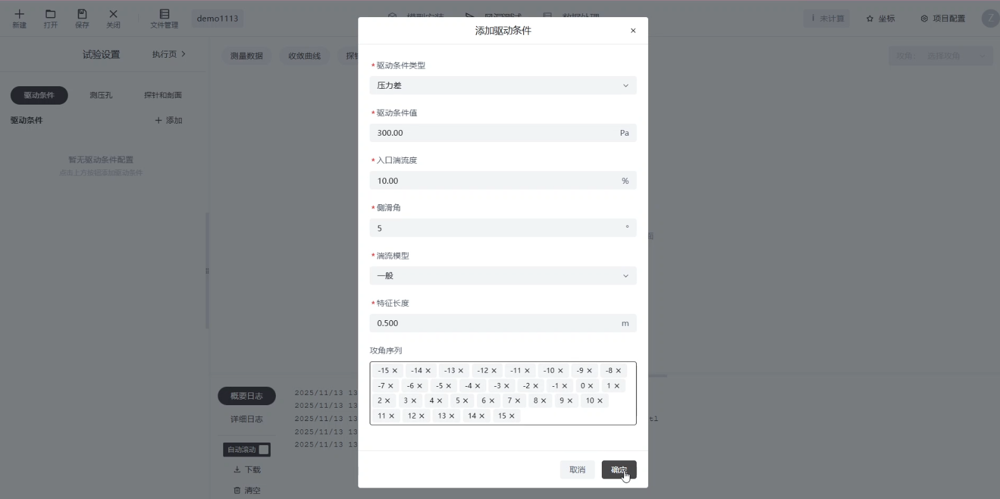
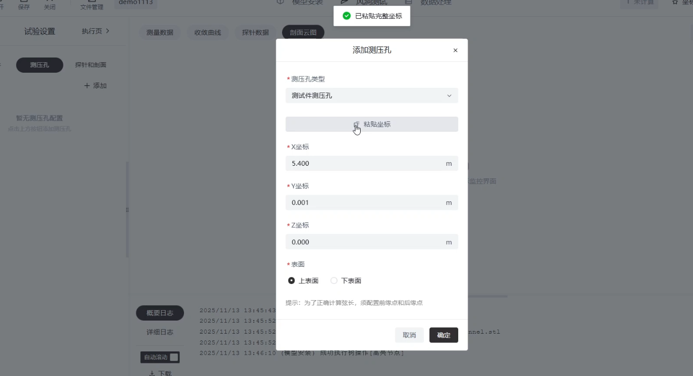
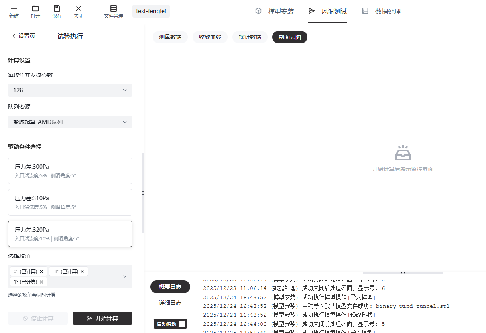
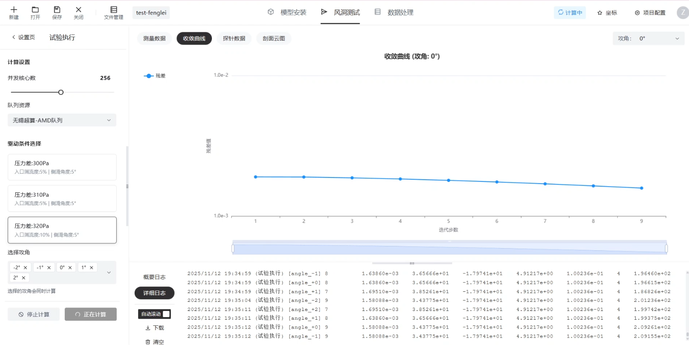
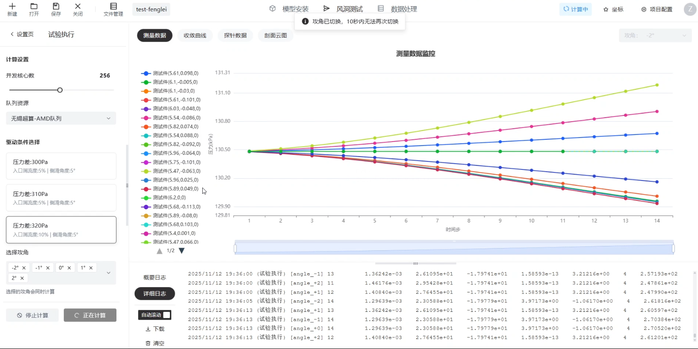
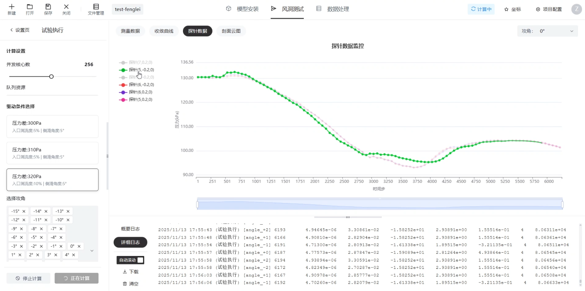
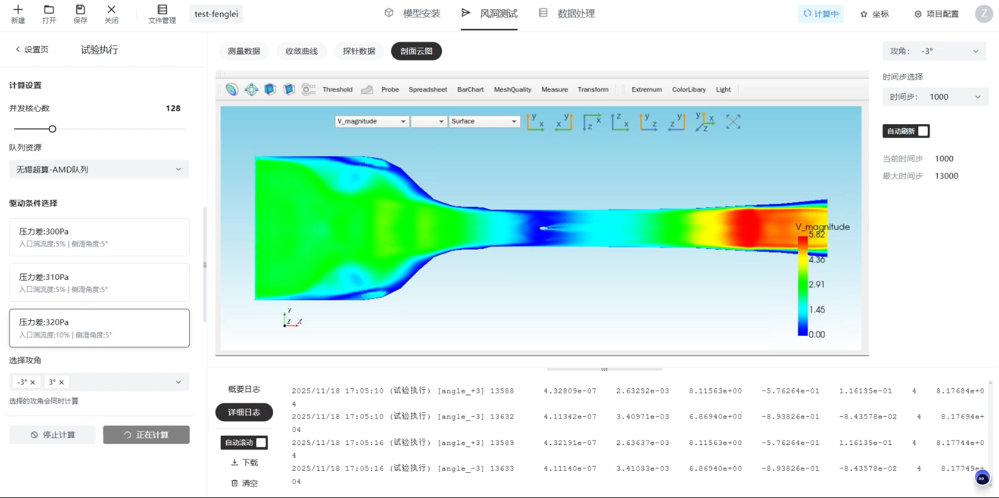

# 风洞测试

单击平台最上方切换标签页至“风洞测试”

## 驱动条件

驱动条件可以按照如下设置。驱动条件类型选择压力差，驱动条件值可自行输入，侧滑角输入5°，湍流模型选择一般，特征长度按照实际值输入。

<figure markdown="span">
  { width="500" }
  <figcaption>添加驱动条件</figcaption> 
</figure>

攻角输入支持两种方式：

1. 分别键入每个攻角值，例如：0、5、10、15、20，然后enter回车即可添加
2. 直接粘贴通过逗号分隔的攻角值，例如：`-10,-9,-8,-7,-6,-5,-4,-3,-2,-1,0,1,2,3,4,5,6,7,8,9,10`，然后enter回车即可添加

<figure markdown="span">
  { width="500" }
  <figcaption>攻角序列粘贴</figcaption> 
</figure>
<figure markdown="span">
  { width="500" }
  <figcaption>攻角序列粘贴后识别</figcaption> 
</figure>

## 测压孔

您可以输入翼型表面测压孔的位置，例如：`0.25,0.5,0.75`，同样的，您可以直接粘贴坐标、交互框会自动识别坐标并添加测压孔。

<figure markdown="span">
  { width="500" }
  <figcaption>添加测压孔</figcaption> 
</figure>

如果您使用的是本文档压缩包中的预设翼型模型，您可以按照如下坐标设置测压孔：

| 上表面                 | 下表面                | 
| -------------------   | --------------------- |
| 5.4, 0.00057 6975,0   |  5.47, -0.0632422, 0  |       
| 5.47, 0.0662721, 0    |  5.54, -0.0862062, 0  |    
| 5.54, 0.0879955, 0    |  5.61, -0.100612, 0   |   
| 5.61, 0.0978358, 0    |  5.68, -0.113, 0      |
| 5.68, 0.103086, 0     |  5.75, -0.100934, 0   |   
| 5.75, 0.0883245, 0    |  5.82, -0.0922, 0     | 
| 5.82, 0.0740211, 0    |  5.89, -0.0797365, 0  |    
| 5.89, 0.0485131, 0    |  5.96, -0.0641, 0     | 
| 5.96, 0.0247993, 0    |  6.03, -0.0475641, 0  |    
| 6.03, 0.00385507, 0   |  6.10, -0.0295278, 0  |    
| 6.10, -0.00496935, 0  |  6.2,-0.000288889,0   |   

## 探针和剖面

您可以按照如下表格中的坐标设置探针点

| 探针点         |
| -------------- |
| 5.0, -0.2, 0   |       
| 5.0, 0.2, 0    |       
| 6.0, -0.2, 0   |       
| 6.0, 0.2, 0    |       
| 7.0, -0.2, 0   |       
| 7.0, 0.2, 0    |       

您可以设置计算过程中需要观察的剖面，距离指的是xyz某个方向的剖面与原点的距离

<figure markdown="span">
  { width="500" }
  <figcaption>添加剖面</figcaption> 
</figure>

## 试验执行

在这个页面可以设置提交计算前需要的参数

您可以设置【每攻角并发核心数】，它指的是计算每个攻角需要的核心数量，当您提交多个攻角时，平台会自动根据您设置的每攻角并发核心数，将计算任务分配到集群中进行并行计算。

队列资源选择【盐城超算-AMD队列】，后续会接入更丰富的计算资源。

驱动条件选择您在新建项目时设置的驱动条件选项卡即可。

<figure markdown="span">
  { width="500" }
  <figcaption>试验执行</figcaption> 
</figure>

最后可以通过下拉框选择需要计算的攻角，点击【开始计算】即可提交本次翼型试验到数字风洞中，多个攻角会同时开始计算。

计算开始后，您可以通过标签页切换观察收敛曲线、测量数据、探针数据、剖面云图。

<figure markdown="span">
  { width="500" }
  <figcaption>收敛曲线</figcaption> 
</figure>

<figure markdown="span">
  { width="500" }
  <figcaption>测量数据</figcaption> 
</figure>

<figure markdown="span">
  { width="500" }
  <figcaption>探针数据</figcaption> 
</figure>

<figure markdown="span">
  { width="500" }
  <figcaption>剖面云图</figcaption> 
</figure>

